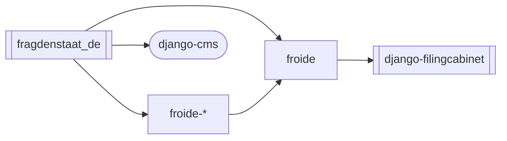

# FragDenStaat.de


[FragDenStaat.de](https://fragdenstaat.de) is the German instance of [Froide](https://github.com/okfde/froide) – a freedom of information portal software.

## Development environment

FragDenStaat.de is a Django app with a PostgreSQL+PostGIS database and elasticsearch search service.
[There is a production deployment ansible configuration for details.](https://github.com/okfde/fragdenstaat.de-ansible). If you want an easy start, please use the below instructions with Docker (note that this is for convenience and that the actual deployment does not use Docker at the moment).

If you do not want to use Docker, you can install this like any Django project with dependencies and services.

### Setup dev environment

FragDenStaat.de is a Django project that uses the core `froide` project and other `froide` Django apps as plugins. These froide and related apps are installed from repositories and it makes sense to set them up on your dev machine.

You need to have installed:

- Python 3.10+
- pnpm
- GDAL for Django's GeoDjango
- freetype and imagemagick
- postgresql bindings
- poppler
- qpdf
- ocrmypdf
- pango
- libgeoip
- libmagic

All of these dependencies should be installable via package managers (e.g. `brew` on macOS).

To make the setup easier the following script (`devsetup.sh`) creates a virtual environment, sets up and installs all repos of the Python backend and installs and links all repos of the JavaScript frontend build.

```bash
cd project-dir
curl https://raw.githubusercontent.com/okfde/fragdenstaat_de/main/devsetup.sh | bash
```

To update your setup later:

```bash
cd project-dir
bash fragdenstaat_de/devsetup.sh
```

### Start services

You can run your own Postgres+PostGIS database and Elasticsearch service or run them with Docker.

You need [Docker Desktop](https://docs.docker.com/desktop). Make sure Docker is running and use the following command:

```bash
docker compose -f compose-dev.yaml up
```

This will start Postgres and Elasticsearch and listen on port 5432 and 9200 respectively. You can adjust the port mapping in the `compose-dev.yaml`.

### Setup database

If you need to adjust settings, you can copy the `fragdenstaat_de/settings/local_settings.py.example` to `fragdenstaat_de/settings/local_settings.py` and edit it.

To initialise the database:

```bash
# Activate virtualenv
source fds-env/bin/activate
cd fragdenstaat_de
# Create database structure
python manage.py migrate --skip-checks
```

To get started with some data:

```bash
# Load initial data (e.g. some CMS test fixtures)
python manage.py loaddata tests/fixtures/cms.json
# Create a superuser
python manage.py createsuperuser
# Create and populate search index
python manage.py search_index --create
python manage.py search_index --populate
```

### Import SQL dumps

Example of loading SQL dumps into Docker postgres:

```bash
docker compose -f compose-dev.yaml exec db dropdb -U fragdenstaat_de fragdenstaat_de
docker compose -f compose-dev.yaml exec db createdb -U fragdenstaat_de -O fragdenstaat_de fragdenstaat_de
gunzip -k -c dump.sql.gz | docker compose -f compose-dev.yaml exec -T db psql -U fragdenstaat_de
```

### Quick start after setup

```bash
source fds-env/bin/activate
cd fragdenstaat_de
# Start service in background with -d
docker compose -f compose-dev.yaml up -d
python manage.py runserver
```

### Frontend development

```bash
cd fragdenstaat_de
pnpm run dev
```

### Upgrade dependencies

```bash
make dependencies
```

### Main app dependencies

The `fragdenstaat_de` project depends on `froide`, multiple `froide`-related apps.



## License

Froide and fragdenstaat_de are licensed under the AGPL License.
