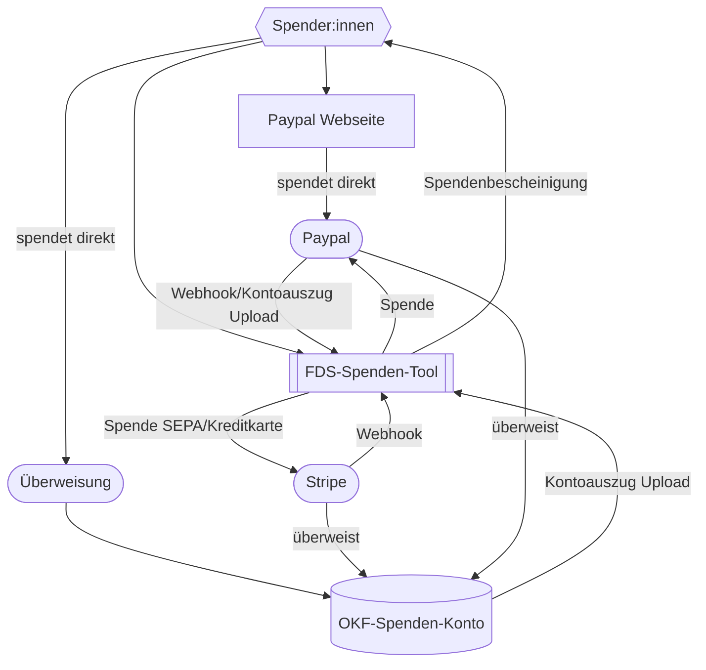

# Flow

```mermaid
flowchart TB
    donor{{Spender:innen}} --> paypalweb
    donor --> fds[[FDS-Spenden-Tool]]
    fds -- Spende SEPA/Kreditkarte -->stripe([Stripe])
    stripe -- Webhook -->fds
    fds--Spende -->paypal([Paypal])
    paypalweb[Paypal Webseite] -- spendet direkt --> paypal
    paypal -- Webhook/Kontoauszug Upload --> fds
    donor -- spendet direkt -->banktransfer([Überweisung])
    banktransfer-->bankaccount[(OKF-Spenden-Konto)]
    stripe -- überweist --> bankaccount
    paypal -- überweist --> bankaccount
    bankaccount-- Kontoauszug Upload -->fds
    fds -- Spendenbescheinigung --> donor

```
